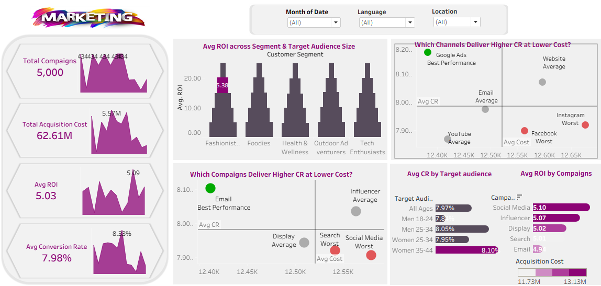

  

# 📢 Marketing Campaign Performance Dashboard

## 📊 Overview
This project analyzes marketing campaign performance using Tableau by building an interactive dashboard that tracks campaign efficiency, acquisition cost, conversion rate, and ROI across multiple channels and audience segments.

The dashboard helps marketers understand which campaigns and channels generate the highest returns while minimizing acquisition costs.

---

## 🎯 Objective
- Analyze campaign performance across marketing channels  
- Compare ROI and conversion rates by audience segment  
- Identify cost-efficient acquisition channels  
- Evaluate campaign effectiveness across demographics  
- Optimize marketing budget allocation  

---

## 📌 Key KPIs
- Total Campaigns  
- Total Acquisition Cost  
- Average ROI  
- Average Conversion Rate (CR)  

---

## 📊 Dashboard Insights
- Google Ads achieved the best overall performance with high conversion rates and lower acquisition costs.
- Social Media and Instagram campaigns showed lower ROI despite higher spending.
- Women aged 35–44 recorded the highest average conversion rate among all audience groups.
- Tech Enthusiasts and Outdoor Adventurers generated stronger ROI compared to other customer segments.
- Influencer campaigns maintained stable ROI performance with moderate acquisition costs.
- Some high-cost campaigns delivered below-average conversion rates, indicating inefficient budget allocation.

---

## 💡 Recommendations
- Increase investment in high-performing channels like Google Ads.
- Reduce spending on low-ROI campaigns and optimize targeting strategies.
- Focus on audience segments with higher conversion potential, especially Women 35–44.
- Improve campaign personalization for underperforming demographics.
- Continuously monitor acquisition cost vs conversion rate to maximize marketing efficiency.

---

## 🛠️ Tools Used
- Tableau  
- Data Visualization  
- Marketing Analytics  
- KPI Tracking  

---

## 📈 Dashboard Features
- Interactive filters for Month, Language, and Location  
- ROI analysis by customer segment  
- Conversion Rate vs Acquisition Cost comparison  
- Audience-based campaign performance analysis  
- Campaign ROI ranking visualization  

---

## 🔗 Project Sharing

👉 LinkedIn Case Study:(https://www.linkedin.com/posts/aml-ghazy-b1a50b3a4_marketinganalytics-tableau-dataanalysis-share-7422747895260512256-f0wb?utm_source=share&utm_medium=member_desktop&rcm=ACoAAGMIDIYBHodAL2wtNlFwkDPUWM0DzigmRgk) 
